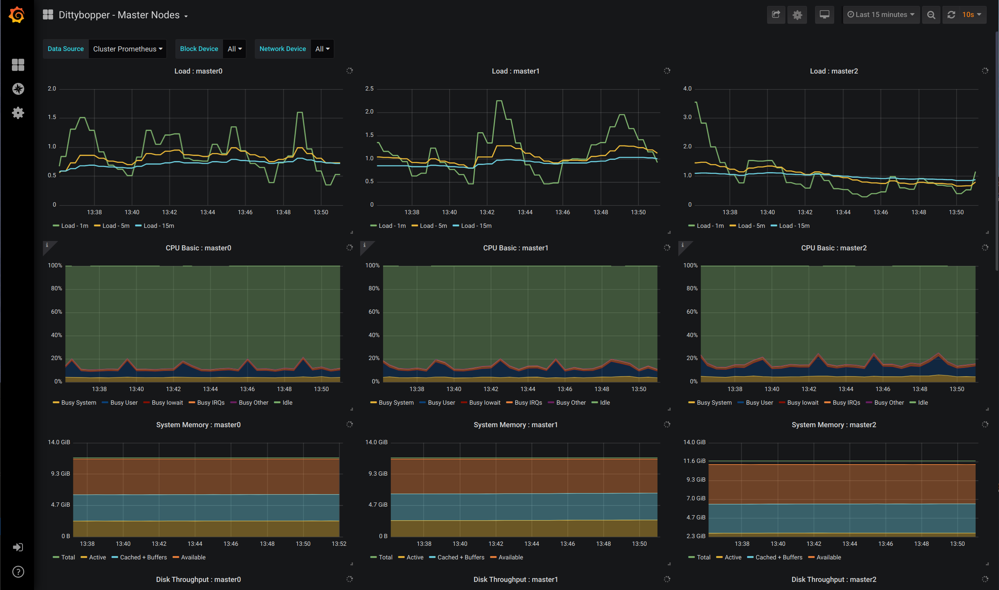

# Dittybopper



## whatis

Dittyboppter is a quick-and-dirty way to deploy system-level submetric monitoring with Grafana
in an OpenShift 4 environment. It deploys a stand-alone mutable Grafana pod with default
dashboards to monitor things like CPU, memory, network, and disk activity. There are other
dashboards available in [arsenal](https://github.com/cloud-bulldozer/arsenal), and the deployment can be customized with your
own dashboards. The Grafana charts expect to receive metrics from an existing Prometheus
deployment and node exporters.

## Getting Started / Prerequisistes

Right now Dittybopper has a number of FIXMEs that need to be addressed before it will be more portable across
k8s/OpenShift environments. It should generally deploy out-of-the-box with OpenShift 4. Other environments
will likely have a prerequisite to first stand up a Prometheus pod, and the Dittybopper scripts and 
templates will need adjustment accordingly. The default dashboard included via
[arsenal/system-metrics-dashboards/grafana/master_nodes.json](https://github.com/cloud-bulldozer/arsenal/blob/master/system-metrics-dashboards/grafana/master_nodes.json)
is currently designed for a 3-master OpenShift 4 deployment.

## Contribute

Pull requests are encouraged. If you find this tool useful, please help extend it for more use cases.

## Deploy

### Deploy Grafana on OpenShift Cluster with Dashboards

```
$ git clone https://github.com/cloud-bulldozer/dittybopper.git
$ cd dittybopper
$ ./deploy.sh [-c <kubectl_cmd>] [-m <host1> <host2> <host3>] [-n <namespace>] [-p <grafana_pwd>]
```

See `./deploy.sh -h` for help.

Simply running `./deploy.sh` with no flags will assume OpenShift, the _dittybopper_ namespace, and _admin_ for the password.

### Import Dashboard

This will import a dashboard (json) into an existing Dittybopper Grafana deployment. The dashboard path
can be either a local file or a URL beginning with http.

```
$ ./deploy.sh -i <path_to_dashboard_json_file>
```

### Delete Grafana Deployment

```
$ ./deploy.sh -d
```
